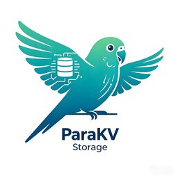

# ParaKV

**Parallel KV for LLM & Recommendation at Storage Speed**

<div align="center">
    
</div>

ParaKV is a high-performance KV storage engine purpose-built for two demanding workloads: **LLM KV Cache** and **recommendation-system sparse parameters**. By combining SPDK user-space NVMe drivers, RDMA networking, and an append-only segment layout, ParaKV delivers microsecond-level latency and millions of QPS on commodity hardware.

## Key Features

- **Microsecond Latency** — User-space NVMe driver (SPDK) with polling mode eliminates kernel overhead, achieving single-digit microsecond read/write latency.
- **O(1) Lookups** — In-memory hash index with fixed-size key/value slots enables constant-time point lookups without tree traversal.
- **RDMA & NVMe-oF Offloading** — Kernel-bypass, zero-copy data transfer via RoCEv2; supports NVMe over Fabrics for disaggregated storage with near-zero CPU involvement.
- **Hot/Cold Separation** — Automatic hot-data identification and in-memory caching of hot segments; cold segments stay on SSD with background compaction, reducing write amplification and extending SSD lifespan.
- **Tiered Storage (DRAM + SSD)** — Scales beyond memory limits to 10 TB+ model parameters or PB-level KV Cache, with transparent data placement.
- **Append-Only Segments** — Log-structured segment design (default 256 MB) with bitmap-based slot tracking; sequential writes maximize SSD internal parallelism.
- **WAL-Based Crash Recovery** — Write-ahead log for index mutations ensures durability; periodic snapshots + WAL replay enable fast, consistent recovery.
- **Scalable Cluster** — Hash-slot–based sharding (16384 slots) inspired by Redis Cluster; supports online resharding with zero downtime.
- **Version Management** — Full and incremental model updates for parameter server scenarios, with atomic version switching.
- **Easy Integration** — Compatible with mainstream RoCE NICs; seamlessly integrates with the brpc microservice framework; Python bindings via pybind11.

## Architecture

ParaKV can be deployed as an **embedded KV store** (linked directly into an inference engine or parameter server) or as a **standalone storage cluster** with horizontal scaling.

```
┌──────────────────────────────────────────────────┐
│                  Management Layer                 │
│   Cluster · Service Discovery · Replication · HA  │
├──────────────────────────────────────────────────┤
│                   Interface Layer                 │
│     CRUD API · Version Control · Load Balancing   │
├────────────────────┬─────────────────────────────┤
│   Storage Engine   │      Transport Engine        │
│  Index · Segment   │    TCP · RDMA · KeepAlive    │
│  WAL · Compaction  │    Auto Route Selection      │
├────────────────────┴─────────────────────────────┤
│              NVMe SSD / DRAM / Block Device       │
└──────────────────────────────────────────────────┘
```

### Storage Engine

- **In-Memory Index** — Open-addressing hash map storing `key → disk_address` mappings. The address field encodes a flag (file offset / segment+slot / memory pointer) and location in a compact 64-bit value.
- **Segment Manager** — Manages a pool of fixed-size segments on files or raw block devices. Each segment contains a bitmap area (slot occupancy) and a slot data area (key + value). Segments transition through IDLE → APPENDING → FULL states.
- **Compaction** — When a FULL segment's deleted-slot ratio exceeds a threshold (default 75%), valid slots are migrated to a fresh segment and the old one is recycled. Hot segments are exempt from compaction.
- **WAL** — Append-only write-ahead log records index mutations (insert / update / delete) with CRC32 checksums. Supports batch writes and periodic snapshots for fast recovery.

### Transport Engine

- **RDMA (RoCEv2)** — One-sided RDMA Read/Write for data transfer; connection pooling, memory region management, and automatic failover.
- **TCP Fallback** — Standard TCP transport with automatic route selection based on KeepAlive probing.

## Requirements

- Linux (Ubuntu 24.04 recommended)
- C++20 compiler (GCC 13+ or Clang 17+)
- CMake 3.27+
- Rust toolchain (stable)
- Python 3.11+ (for pybind11 bindings)
- [vcpkg](https://github.com/microsoft/vcpkg) (auto-fetched if `VCPKG_ROOT` is not set)

## Quick Start

### Build with Docker

```bash
cd docker
docker build -t parakv:latest .
docker run -it --rm parakv:latest
```

### Build from Source

```bash
# Install vcpkg (or set VCPKG_ROOT)
git clone https://github.com/microsoft/vcpkg.git /opt/vcpkg
export VCPKG_ROOT=/opt/vcpkg

# Build
cmake -S . -B build -DCMAKE_BUILD_TYPE=Release
cmake --build build --parallel
```

### Run Tests

```bash
cd build
ctest --output-on-failure
```

## Project Structure

```
ParaKV/
├── CMakeLists.txt          # Top-level build
├── vcpkg.json              # Dependency manifest
├── docker/                 # Docker build environment
├── docs/
│   └── cn/                 # Design documents (Chinese)
├── parakv/
│   ├── common/             # Global flags and utilities
│   └── core/
│       ├── cache/          # LRU cache
│       └── segment/        # Segment storage engine
│           ├── segment_base.{h,cc}
│           ├── segment_file.{h,cc}
│           ├── segment_block_dev.{h,cc}
│           └── segment_manager.{h,cc}
├── cmake/                  # CMake modules
└── third_party/            # brpc, etc.
```

## Documentation

Detailed design documents are available in [`docs/zh/design`](docs/zh/design):

| Document | Description |
|:---------|:------------|
| [Introduction](docs/zh/design/introduction.md) | Background, design goals, RDMA & NVMe technology overview |
| [Architecture](docs/zh/design/architecture.md) | System architecture, cluster management, hash-slot sharding |
| [Index & WAL](docs/zh/design//index.md) | In-memory hash index, WAL format, snapshot & recovery |
| [Segment](docs/zh/design/segment.md) | Segment layout, compaction, hot/cold data management |
| [Version Management](docs/zh/design//version-management.md) | Full & incremental model update strategies |

## License

This project is licensed under the [Apache License 2.0](LICENSE).
