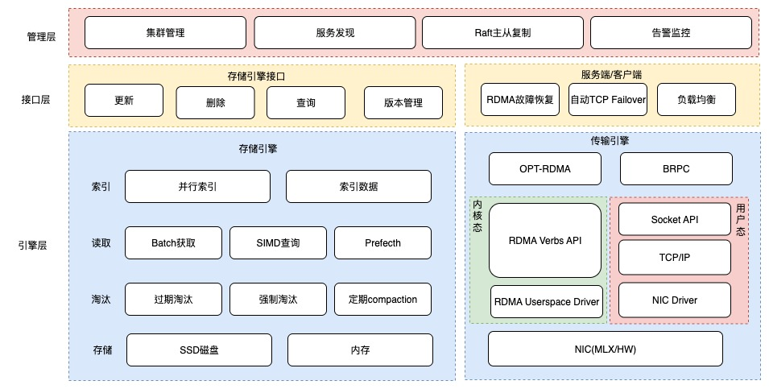
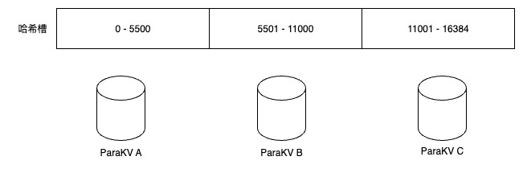

# 综述
ParaKV设计目标，是既可以作为embedding KV存储，直接潜入到推理引擎或参数服务器中； 也可以搭建存储集群，提供可以横向扩展的持久化存储集群。

# 单实例系统架构
单实例系统架构如下：  

* **存储引擎**：支持SSD、内存等存储介质，提供索引、数据存储、老化等功能。
* **传输引擎**：支持TCP、RDMA传输通道，并根据KeepAlive自动选择路由。
* **接口层**：提供存储引擎的增删改查功能，对于参数服务器场景，提供了版本管理的功能；对于传输引擎，提供故障恢复、负载均衡
* **管理层**：提供集群管理、服务发现、主从复制、告警监控

# 集群管理
ParaKV采用去中心化的集群管理方案，采用Redis Cluster的哈希槽的集群管理方案，方便进行集群容量的扩容。

ParaKV 集群有16384个哈希槽，每个key通过CRC16校验后对16384取模来决定放置哪个槽。集群的每个节点负责一部分hash槽，举个例子，比如当前集群有3个节点，那么节点 A 包含 0 到 5500号哈希槽，节点 B 包含5501 到 11000 号哈希槽，节点 C 包含11001 到 16384号哈希槽。  
那么使用哈希槽有什么优势呢？那就是扩缩容，我们使用哈希槽时，增加减少Redis节点就会很方便，如果我们想要新添加个节点D, 我们只需要从之前的节点分部分哈希槽到节点D上。 如果我想移除某个节点，只需要将该节点中的哈希槽移到另外两个节点上，然后将该节点从集群中移除即可.。  
从一个节点将哈希槽移动到另一个节点并不会停止服务，所以无论添加或是删除节点都不会造成集群的不可用，这样就实现了动态扩缩容。