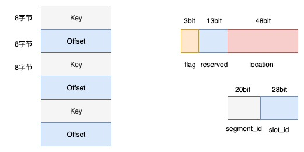
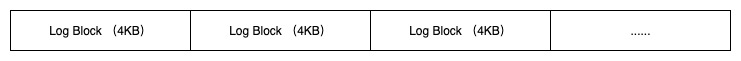

# 综述
高性能存储引擎需要支持内存型和内存+SSD混合的存储介质，来应对不同的存储规模。

# 内存索引
内存索引采用key和数据（value）分离的结构，索引中存储的key和数据偏移(offset)，通常采用开放定制法的hashmap索引结构。  

以传统稀疏模型参数为例，hashmap中，Key为uint64_t类型键，占用8字节；value存储的是offset字段，该字段根据不通的存储介质和索引类型，对flag和location有不同的定义：
| flag标记位 | 说明 |
|:------|:-------|
| 000 | 文件块偏移，兼容当前PS实现 |
| 001 | 裸磁盘架构，对应的是segment_id和slot_id编码 |
| 002 | 内存地址（热数据缓存）|

备注：
1. 48bit代表的地址空间范围约256TB  
2. 20bit代表的无符号整数范围0 ~ 1,048,575  
3. 28bit代表的无符号整数范围0 ~ 268,435,455

内存索引需要具备Dump的能力，将内存索引进行持久化；同时，索引需要提供从dump文件中快速加载提供服务。

# WAL索引日志
WAL的核心目标是保证内存索引（持久化索引）在系统崩溃后能够准确恢复，而不会丢失任何已提交的更新，其也是整个系统中比较核心的模块。

## WAL的作用和定位
* **仅记录索引变更**：WAL 记录的是对Key → DiskAddress映射的修改操作（插入、更新、删除），不记录 Value 数据本身（Value 已通过 Append‑Only Segment 持久化）。
* **确保持久化索引的可恢复性**：通过“先写日志，后更新内存索引”的规则，保证即使内存索引丢失，也能从磁盘上的快照 + WAL 重建出完整的内存索引。
* **与数据分离**：WAL 独立于 Segment 存储，通常使用专用的 NVMe 命名空间或文件，避免与数据段争抢 IO 带宽。
## WAL的存储布局WAL 
采用追加写（Append‑Only）方式，存放在一个或多个预分配的裸磁盘区域（通过 SPDK 直接管理）或普通文件中（若使用文件系统）。
WAL文件/Section结构如下：

每个 Log Block 包含若干条 WAL 记录，以及一个尾部校验和。日志按顺序写入，当块写满时追加新块。每条记录固定长度（便于快速定位），但为了节省空间，可采用变长编码。下面给出一种紧凑的固定长度格式（适用于 uint64_t key，8 字节地址）：
| 字段    | 长度 (字节)  | 说明 |
|:--------|:----------|:----------------|
| Magic  | 1 | 固定魔数，用于校验记录完整性 |
| Type   | 1 | 操作类型：0x01=Insert, 0x02=Update, 0x03=Delete |
| Key | 8 | Key 值（uint64_t）|
| DiskAddr | 8  | 磁盘地址（LBA 或 Segment+Slot 编码），对于 Delete 操作可为 0 |
| OldDiskAddr |  8 |  仅 Update 操作有效，表示更新前的磁盘地址；Insert/Delete 为 0 |
| Checksum | 4 | 对前面字段的 CRC32 校验和 |

总长度 = 1+1+8+8+8+4 = 30 字节。为了对齐，可以填充到 32 字节。  
若 Key 为 uint128_t（16 字节），则可调整格式，总长度变为 38 字节，同样可填充到 64 字节对齐。  
每个块大小为 4KB（对齐到 NVMe 块大小），内部记录连续存放。块末尾预留 4 字节用于块校验和（可选）。  
## WAL的写入流程
WAL 的写入必须保证原子性：要么记录完整写入，要么完全不写入。通过以下机制实现：
### 全局序列化
* 使用单线程或全局锁串行化所有 WAL 写入操作，确保顺序与内存索引更新顺序一致。
* 在高并发场景，可设计多日志流，根据 Key 哈希分区，每个分区独立序列化。
### 写入步骤
* **构造记录**：填充类型、Key、DiskAddr、OldDiskAddr，计算校验和。
* **获取当前日志位置**：维护当前块的写入偏移（Block ID + 块内偏移）。
* **追加写入**：通过 SPDK 异步写入当前块中（如果块剩余空间不足，先填充零并写入新块）。
* **等待写入完成（可选同步或异步）**：
  * 为保证一致性，推荐使用同步写入，即等待 SPDK 完成回调，再更新内存索引。
  * 若采用异步，需确保索引更新前 WAL 已持久化（可使用spdk_nvme_ns_cmd_write的完成回调）。
* **更新内存索引**：根据操作类型，更新哈希表。
* **更新日志元数据**：记录当前日志位置（用于恢复）。
### 批量优化
* 合并多个请求：将多个记录的构造与写入合并为一个 I/O 请求，减少小 I/O 次数。
* 使用 SPDK 的批量提交接口（如spdk_nvme_ns_cmd_writev）一次写入多条记录。
* 设置写缓冲区（例如 128KB），积累到阈值后再刷盘，但需注意故障时可能丢失部分记录（可接受，因为未提交的索引更新也丢失，但已写 WAL 的记录必须完成）。
### 并发控制
* **索引更新**：在 WAL 写入完成后，通过原子操作（如 CAS）更新哈希表。由于 Key 互不冲突，可细粒度加锁。
* **日志写入锁**：仅保护日志分配和写入操作，不阻塞索引更新。
## 快照（snapshot）与清理
### 快照机制
* **触发**：定期（如每 10 分钟）或当 WAL 大小超过阈值（如 1GB）时，触发一次快照。
* **内容**：当前内存索引的全量拷贝（Key → DiskAddr）。
* **存储**：快照写入独立的磁盘区域（同样通过 SPDK 管理），格式为(Key, DiskAddr)的连续记录，并附带元数据（版本号、时间戳）。
* **原子性**：生成快照时，暂停写入（或使用 Copy‑on‑Write 技术），确保快照一致性。
### 清理 
* WAL快照完成后，可以截断 WAL，删除快照之前的所有记录。
* 保留快照之后的部分 WAL，用于恢复时的增量重放。
* 实现方式：将日志文件/区域视为循环缓冲区，保留两个区域：当前活跃区和旧区。快照后，重置当前活跃区指针。
### 恢复过程
* 加载最新的快照，重建内存哈希表。
* 从快照记录的日志位置开始，读取后续的所有 WAL 记录。
* 对每条记录，校验通过后，依次应用到内存哈希表。
* 恢复完成后，正常提供服务。
### 与compaction的交互
Compaction 会修改内存索引（因为迁移后 Key 的磁盘地址发生变化），因此 Compaction 对索引的更新也必须记录到 WAL。
* Compaction 线程在更新索引前，先写 WAL 记录（操作类型为 Update，携带新旧地址）。
* 由于 Compaction 可能批量更新大量 Key，可批量写入 WAL，减少日志开销。
* Compaction 完成后，旧 Segment 被标记为可回收，无需记录 WAL（因为索引已更新，旧地址已不再被引用）。
### 故障恢复
恢复步骤如下：
* 读取快照文件，加载所有(Key, DiskAddr)到内存哈希表。
* 获取快照记录的日志位置snapshot_lba。
(从snapshot_lba开始，顺序读取每个日志块，解析记录，校验通过后应用：
  * Insert/Update：将哈希表中 Key 更新为新的 DiskAddr。
  * Delete：从哈希表中删除 Key。
* 恢复完成后，设置当前 WAL 写入位置为最后一条记录之后。   

校验与完整性需要注意：
* 每条记录带有 CRC32 校验，防止部分写入。
* 日志块末尾也可存储块校验，用于检测块损坏。
* 如果遇到校验失败，可能日志截断，丢弃后续记录（对应未提交的操作）。