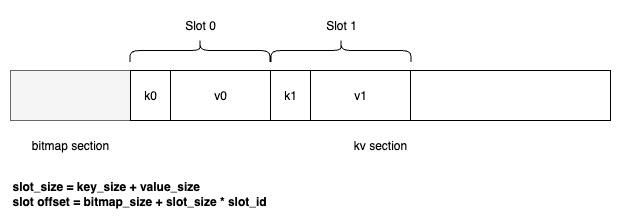

# 综述
ParaKV支持将数据持久化存储到文件或块设备(裸磁盘)中，为管理大容量数据，会切成数据块segment，例如大小为256MB块，以方便做数据回收和版本管理。
# 数据组织

每一个segment数据块由2部分组成：

**1）bitmap区**  
存储每个slot的使用情况，0标识该slot空闲或被删除掉，1标识该slot被占用。ParaKV支持的业务场景，Key占用的空间是固定大小的：在参数服务器场景中，Key通常为`uint64_t`类型的无符号长整数；LLM KVCache中，Key通常为Prefix Cache Block的散列值，长度固定为64或128字节，具体取决于Hash算法；Value也是固定的，取决于模型参数的维度和数据类型大小，或KVCache块、维度、数据类型大小。

**2）slot数据区**  
每一个slot有key和value组成，这里key做了冗余处理，主要是为了方便数据恢复和校验使用。 

数据在segment块中的偏移是可以根据上述信息计算出来的，计算逻辑参见下图：

# KV添加
为保证磁盘性能，不支持原地修改操作，仅支持在segment进行append-only的操作，来减少磁盘IO。实现上，需要遵循：  
1）batch写入  
SSD写入是按页面单位来操作的，需要读整页，修改部分内容，再整页写入；为减少IO操作，可以采用积攒数据，批量写入来提升性能，降低IO操作。  
2）索引及数据修改顺序  
应当遵循先数据写入指定segement数据区，修改该segment的bitmap区，标记slot位的占用，最后再更新内存索引。  

# KV删除
KV删除仅需要修改内存索引和bitmap区，不需要擦除slot的数据。删除时先删除内存索引，再修改bitmap区。

# 数据compaction
segment数据块的状态：
| 状态 | 说明  |
|:----|:------|
|IDLE | 空闲   |
| APPENDING | 使用中，但有slot空闲，可以用来追加新数据 |
|FULL | 使用中，但无slot空闲，处于只读状态  |

当segment处于FULL状态，但删除的slot ID的数量超过指定阈值时，如75%，可以对其进行compaction：  
1）申请空闲的segement，将需要compaction的数据，整理到新申请的segment上，同时修改内存索引。  
2）整理完成后，将bitmap区初始化为0，并将segment设置为IDLE状态  

# Segment管理

## 快照
Segment 管理负责磁盘空间的分配、Slot 位图维护以及 Compaction 等关键功能。Segment 的元数据（如每个 Segment 的位图、空闲 Segment 列表、当前活动 Segment 等）同样需要持久化，以确保系统崩溃后能够正确恢复磁盘布局，避免数据错乱或空间泄漏。 实现可参考具体设计可以参考索引WAL预写日志部分。

### Segment管理优化
可以考虑将热点数据集中放置在某些segment数据块中，在生产环境（如参数服务器）中，热点数据往往只占总量的一小部分（例如 20% 的 Key 贡献了 80% 的访问），将这些热数据所在的 Segment 整体缓存到内存，确实可以大幅降低磁盘 I/O 和 Compaction 频率，提升资源利用率。该技术点已被许多高性能存储系统（如 RocksDB 的 BlobDB + 热分区、Facebook's FLASH 等）验证有效。核心收益包括：  
* 读加速：热 Segment 常驻内存，读操作完全不走磁盘。
* 写加速：热 Segment 的更新直接写内存 + WAL，后台异步刷盘，降低写延迟。
* 减少 Compaction 开销：热 Segment 不再参与 Compaction（或频率极低），避免数据频繁迁移导致的写放大。
* 提升 SSD 寿命：减少对热数据的随机写与重写，降低 NAND 磨损。

需要解决的挑战：热数据识别、动态迁移、内存资源控制、一致性保证。

### 热数据的识别与标记
不能依赖人工配置，必须自动识别。推荐方案：
* 基于内存索引中的访问计数：这块需要提供高效的LFU统计；参数服务器场景可以离线统计出来，提供数据文件。
* 按 Segment 聚合热度：将 Segment 内所有有效 Key 的访问计数求和（或取平均），得到 Segment 的热度值。
* 阈值触发：当 Segment 的热度超过阈值（如平均每分钟访问次数 > 1000），标记为“热 Segment”。

为避免抖动，可采用滑动窗口（如过去 5 分钟的访问计数）或指数衰减。

### 热Segment的存储与内存映射
将热 Segment 整体加载到内存，有两种实现方式：
| 方式 | 优点 | 缺点 | 适用场景 |
|:------|:-------|:------|:------|
|显式缓存（用户态内存池）| 完全控制内存布局；支持零拷贝 RDMA；与 SPDK 无缝集成 | 需要额外管理内存 | 裸磁盘方案 |
| mmap | 编程简单，OS 自动管理页缓存 | 无法绕过内核；与 SPDK 冲突（SPDK 使用用户态驱动，mmap 不可用）| 传统文件块 |

在 ParaKV 的 SPDK 裸磁盘架构下，只能使用显式缓存。具体做法：
* 为热 Segment 分配一块固定大小的内存池（如 10% 系统内存）。
* 将 Segment 的所有 Slot 数据一次性读入内存（通过 SPDK 异步读取）。
* 内存中维护*segment_id → 内存指针*的映射。
* 对于热 Segment 中的 Slot 读写，直接操作内存（无需经过 SPDK）。

### 写入流程的变化
对热 Segment 的写入需要特殊处理，保证持久化：
* **写路径**：  
  * 更新内存中的 Slot 数据。  
  * 同时追加写入 WAL（记录本次修改）。  
  * 异步将整个 Segment 或增量变更刷回磁盘（可周期性刷盘，如每 1 秒）。
* **崩溃恢复**：加载快照后，重放 WAL，将热 Segment 重新加载到内存。
注意：WAL 必须记录完整的 Slot 数据（因为热 Segment 在内存中可能已覆盖旧值），而不仅仅是索引变更。可以设计专门的“热 Segment 增量日志”。

### 热数据与冷数据的迁移
* **热变冷**：当 Segment 的热度下降（例如模型上线一段时间后访问减少），需要将其降级为冷 Segment。步骤：
  * 确保该 Segment 的所有数据已持久化到磁盘（强制刷盘）。
  * 从内存缓存中移除该 Segment 的数据。
  * 内存索引中的地址保持不变（仍指向磁盘 LBA），后续读请求将走磁盘。
* **冷变热**：当某个冷 Segment 访问频率突增（例如新模型成为热点），需要将其升级为热 Segment。步骤：
  * 将该 Segment 的全部数据从磁盘读到内存。
  * 标记该 Segment 为热 Segment。
  * 后续读写操作直接在内存中进行。

**迁移时机**：可以在后台线程中周期扫描（如每 30 秒）Segment 热度，触发升降级。

### Compaction 的调整
* **热 Segment 豁免**：Compaction 线程应当跳过所有热 Segment，只对冷 Segment 执行空间回收。
* **冷 Segment 的 Compaction**：按照原有算法（基于无效 Slot 比例）进行。
* **热变冷后的处理**：当 Segment 从热降级为冷时，如果其无效 Slot 比例很高，可以立即加入 Compaction 队列进行清理。

### 内存资源控制
* **上限**：设置热 Segment 缓存的最大内存占用（例如总内存的 20%）。当达到上限时：
  * 禁止新的冷 Segment 升级为热。
  * 触发 LRU 淘汰：选择最不活跃的热 Segment 降级。
* **预留内存**：为热 Segment 缓存预留 DMA 缓冲区（通过spdk_dma_malloc），确保零拷贝。

### 一致性保证
* **读-写冲突**：热 Segment 在内存中，读操作直接返回内存数据；写操作先更新内存再写 WAL。无需额外锁，因为一个 Slot 同时只有一个写者（Key 唯一）。
* **崩溃恢复**：热 Segment 在内存中的数据可能滞后于磁盘（如果异步刷盘尚未完成）。恢复时：
  * 加载索引快照和 Segment 快照。
  * 重放 WAL，恢复所有热 Segment 的最后状态。
  * 将恢复后的热 Segment 重新加载到内存。
* **刷盘周期**：可配置为 100ms~1s，平衡性能与数据丢失风险。对于参数服务器场景，允许少量丢失（可通过上游重算）。